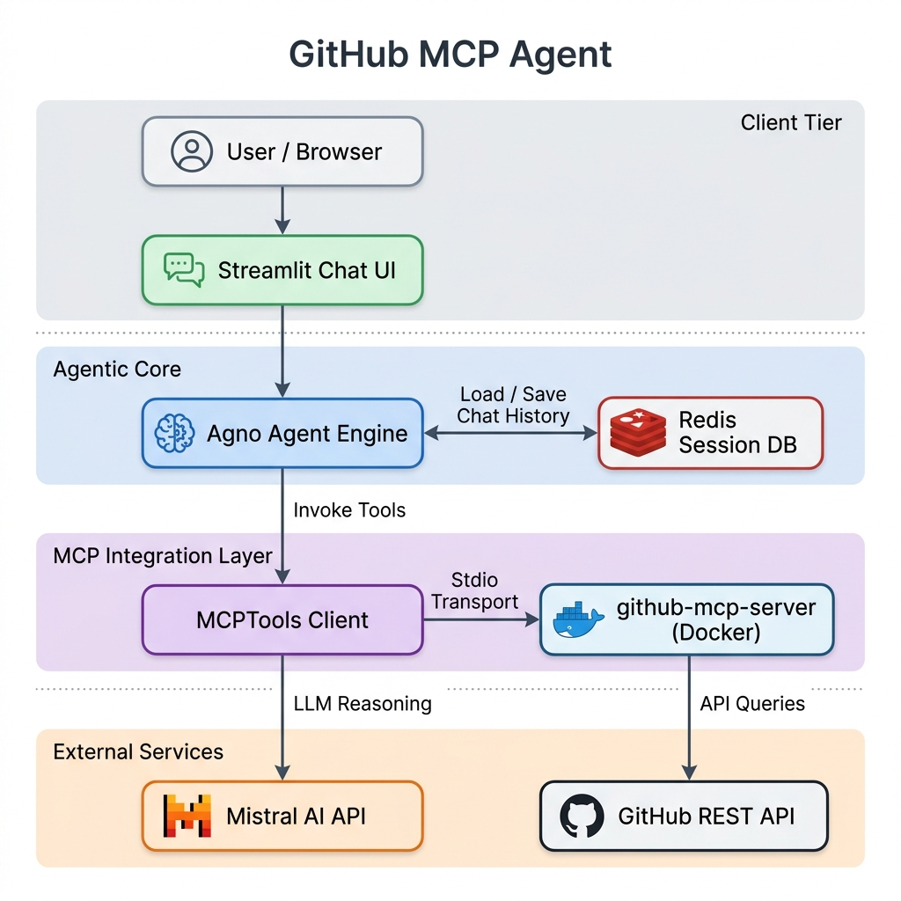
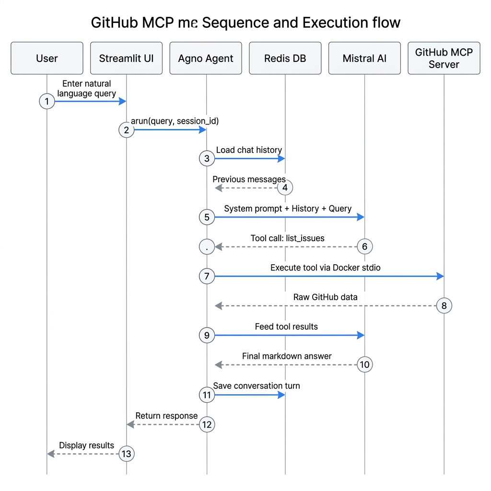

# 🐙 GitHub MCP Agent

An interactive Streamlit chat assistant that lets you query, explore, and analyze GitHub repositories in natural language. Powered by the **Model Context Protocol (MCP)**, **Agno Agentic Framework**, **Mistral AI**, and backed by a persistent **Redis** session storage.

---

## 🏗️ Architecture & How It Works

This application utilizes a decoupled architecture where the user interface, reasoning engine, database, and tool execution environments are segregated:

### System Component Diagram



### Detailed Execution Flow



### Step-by-Step Walkthrough
1. **User Interaction**: The user enters queries and target repository details in the Streamlit UI.
2. **Context Restoration**: The Agno Agent connects to the local Redis container using the `session_id` and restores the chat history.
3. **Reasoning & Tool Selection**: The agent forwards the context to Mistral AI. Mistral decides if a tool call is needed (e.g., fetching commits, issues, or PRs).
4. **Docker-based MCP Execution**: The agent invokes the tool. Under the hood, `MCPTools` executes the official `github-mcp-server` Docker container. The python application communicates with it over standard input/output (stdio).
5. **Data Retrieval**: The MCP server queries the GitHub API using the user's `GITHUB_TOKEN` and returns the structured payload.
6. **Synthesis & Save**: Mistral AI receives the raw GitHub data, formats it into markdown, and returns it to Streamlit while saving the turn in Redis.

---

## ⚡ Key Features

* **Multi-Turn Chat History**: Your chat history is saved in Redis, letting you ask follow-up questions (e.g., *"What was the name of that issue again?"*).
* **Interactive Chat Sessions**: Start new conversations or switch back to past threads directly from the sidebar.
* **Real-time Integration**: Executes queries directly against the live GitHub API using official GitHub tools.
* **Pre-populated sidebar**: Loads credentials automatically from `.env`.

---

## 📋 Prerequisites

1. **Docker**: Docker must be running on your host machine to execute both the Redis container and the GitHub MCP server container.
2. **API Keys**:
   * **GitHub Personal Access Token**: Classic token with `repo` scope.
   * **Mistral API Key**: To power the reasoning agent.

---

## 🚀 Running Locally

### Step 1: Clone & Setup Environment
Create a `.env` file in the root of the project:
```env
MISTRAL_API_KEY="your-mistral-api-key"
GITHUB_TOKEN="your-github-personal-access-token"
```

### Step 2: Spin up Redis DB Container
```bash
docker run -d --name github-agent-redis -p 6379:6379 redis:alpine
```

### Step 3: Create Virtual Environment and Install Dependencies
```bash
python3 -m venv venv
source venv/bin/activate
pip install -r requirements.txt
```

### Step 4: Start Streamlit App
```bash
streamlit run github_agent.py
```
Open **http://localhost:8501** in your browser.

---

## 🐳 Running with Docker Compose (Recommended)

Since the application requires a Redis server and needs to interact with the host's Docker daemon to launch the GitHub MCP server container, the easiest way to run the entire stack is with **Docker Compose**.

### Run the App

1. Ensure your `.env` file is configured in the root directory.
2. Build and launch the containers:
   ```bash
   docker compose up --build -d
   ```
3. Open **http://localhost:8501** in your browser.

This will build the application image, launch the Redis container, mount the Docker socket (`/var/run/docker.sock`) into the application container, load your API keys from `.env`, and link both containers on a shared network.
